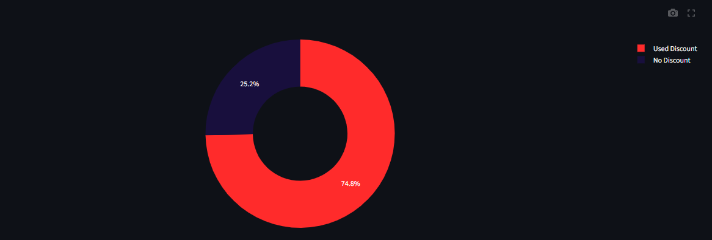

# 📊 Customer Dashboard (2022 - 2024)

This project is part of my **Final Project Portfolio** using **Streamlit**.  
It provides an **interactive dashboard** to analyze customer behavior, sales performance, and product preferences between **2022 - 2024**.

[](https://roy-build-stream.streamlit.app//)
---

## 📂 Dataset
The dataset contains transaction records including:
- Transaction Date  
- Customer Information (ID, Age Group, Segment)  
- Product Purchased (Name, Storage Capacity)  
- Quantity and Total Spending  
- Payment Method & Discount Usage  
- City (transaction location)

---

## ⚡ Features
The dashboard includes:
- **Sidebar Filters** → filter data by year, city, product, and customer segment.  
- **Dynamic Metrics** → display total sales, orders, unique products, and average order values.  
- **Interactive Visualizations** with insights automatically adjusting based on selected filters.  

---

## 📈 Dashboard Visualizations

### 1. Monthly Sales Trend
Shows how sales evolve from **January to December** each year.  
📌 Note: December 2024 data only contains transactions until the last available date, not full month.  


---

### 2. Top Cities Contribution
Displays the top 5 cities contributing most to sales.  


---

### 3. Best Selling Products
Highlights the top 5 products with the highest total sales.  


---

### 4. Storage Capacity Preference
Shows which storage options (e.g., 128GB, 256GB, 512GB) are most popular among customers.  


---

### 5. Discount Usage
Illustrates the proportion of transactions using discount codes.  



---

### 6. Customer Age Distribution
Shows which customer age groups dominate the transactions.  


---

## 💡 Insights
- Sales trend increases over time, with a natural decline in **December 2024** due to incomplete data.  
- **Jakarta** consistently contributes the highest sales.  
- The **iPhone Pro series** dominates product sales.  
- Customers prefer **mid-range storage (128GB & 256GB)** over smaller or larger options.  
- Around **50%+ transactions use discounts**, showing strong promo sensitivity.  
- The **26-35 age group** is the most dominant customer demographic.  

---

## 🚀 How to Run
1. Clone this repo  
2. Install requirements  
   ```bash
   pip install -r requirements.txt
